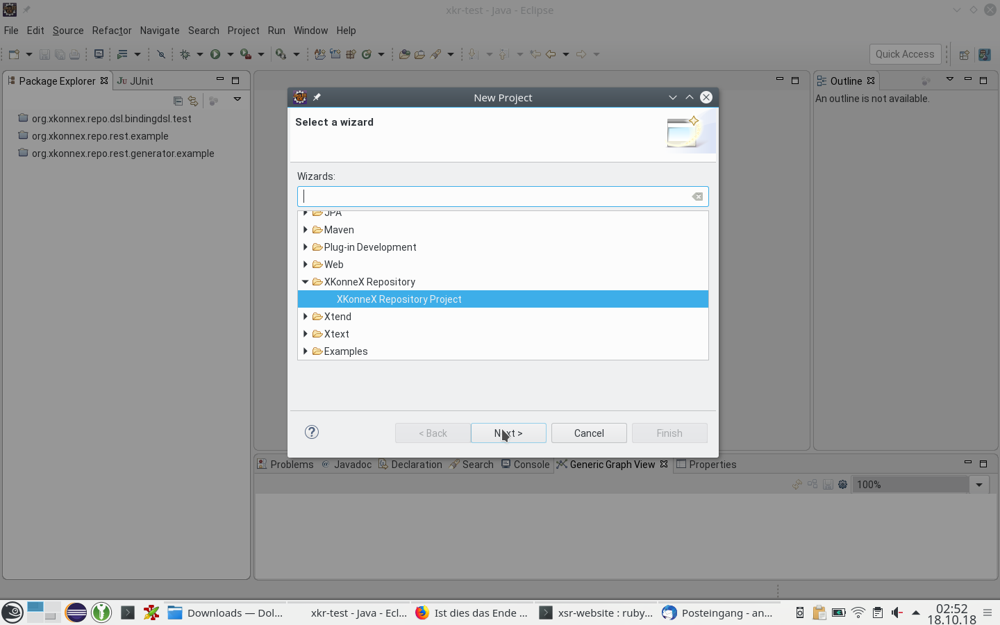

# {{page.title}} {#GettingStarted}

To get started, you should first have a look at XKonneX Repository Example projects. There you will find a simple and a more advanced example. Both examples consist of an XKonneX Repository project containing the domain model and generator project, that shows how to generate code from the model.

## Examples
### Simple example

The simple example has minimal domain model leaving out all advanced concepts around services and architecture governance.

### REST service example

The REST service example demonstrates the modeling of a REST service API

### Advanced example

The advanced example provides an example for more detailed modeling regarding governance properties, system environment definitions and overrides for conventions applied when nothing else is specified.

## Installation

### Requirements and installatiopn sources
XKonneX Repository requires Eclipse Luna with Java 1.8 and Xtext 2.13 or later. 

Please add the following updatesites to your Eclipse installation:
	* <http://dl.bintray.com/andrearn/XtextServiceRepository-updatesite> (XKonneX Repo)
	* <http://rtsys.informatik.uni-kiel.de/~kieler/updatesite/release_0.8/> (KIELER layout framework)
	
You may also add the following update site for Xtext:
	* <http://download.itemis.de/updates>
	
The easiest way add all updatesites is to download and import the Updatesite-bookmark-file available [here](https://github.com/andrearn/org.fornax.soa.xtextservicerepository/blob/master/bookmarks.xml). To import the file select "Help" > "Install New Software ..." from the menu and click on "Available Software Sites" to see the update sites available to your Eclipse installation. By clicking on "Import" you can select and import the downloaded bookmark file.

### Installing the features
Select the XKonneX Repo update site list and select all XKonneX Repo SDKs. Then proceed with "Next" and follow the installation steps. 
 
## Creating a model
### Create a XKonneX repository project

First, let's create a new XKonneX repository project:

 

Give the project a name.
 

### Model services
To model service start by creating a new Service DSL file. 

 

Let's call it _catalog.svcdsl_

 

#### Define the namespace of the services.
We start with a namespace for a catalog. The namespace represents a logical domain that can be accessed via services. Hence, the namespape is a _domain-namespace_ called _com.shop.catalog_.

```ServiceDSL
domain-namespace com.shop.catalog {
	
}
```

##### Defining business objects
Now we need to define some objects: we have articles in our catalog:

```ServiceDSL
domain-namespace com.shop.catalog {
	
	businessObject Article {
		metadata {
			version 1.0
		}
		name : string
		productCategory : string
		articleNumber : long
		price : double
		timeToDeliver :	int
	}
	
}
```

##### Defining a catalog service

We need a service to find arcticles. It will provide two  operations that arcticles by their name or their category

```ServiceDSL
domain-namespace com.shop.catalog {
	
	businessObject Article {
		metadata {
			version 1.0
		}
		name : string
		productCategory : string
		articleNumber : long
		price : double
		timeToDeliver :	int
	}
	
	public service ArticleLookupService {
		metadata {
			version 1.0
		}
		
		findByName (name : string) 
			returns Article [] majorVersion 1

		findByCategory (category : string) 
			returns Article [] majorVersion 1
	}
	
}
```

#### Another domain for the actual shopping
```ServiceDSL
domain-namespace com.shop.sales {
}
```

The namespace will use services and objects from the catalog domain. Therfore we import that namespace:

```ServiceDSL
import com.shop.catalog.*

domain-namespace com.shop.sales {
}
```

And of cause, we need a basket to collect items.

```ServiceDSL
import com.shop.catalog.*

domain-namespace com.shop.sales {

	businessObject Basket {
		metadata {
			version 1.0
		}
		optional items : Item [] majorVersion 1		
		shipmentFee : double
	}
	
	businessObject Item {
		metadata {
			version 1.0
		}
		article : Article majorVersion 1
		numberOfItems : int
	}
}
```


### Bundle services in a module

### Model your runtime environment

### Connect the module to your environment

## Generating code