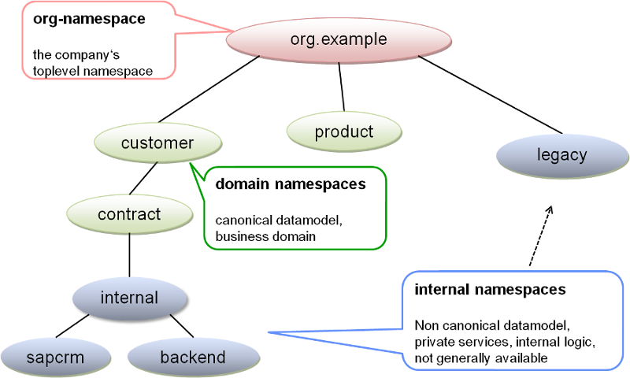

# {{page.title}} {#ModelingConcepts}

## The data model

The data model in a SOA approach may be separated into two major parts:

	1. Canonical data model
	2. Non canonical data model

### Canonical data model

The canonical data model defines data types that are standardized to some extent. It is the "common language". Whenever data are exchanged between different systems, the canonical data model should be used as it protects the user from frequent changes. A canonical data model is scoped to a domain or subdomain. Namespace that belong to the canonical data model are called *domain namespace*s.

### Non canonical data model

The non canonical data model defines data types that are _not_ standardized. The canonical data model is the "local language" of an application or system. Hence, it is considered internal and should only be used internally by that system or application. The non canonical data model enables frequent changes to the data model in a "safe" area, that does not affect other systems or applications. Namespaces that belong to the non canonical data model are called *internal namespace*s.

### Domains and namespaces

The canonical and the non canonical datamodel are organized into domains which are reflected by namespaces. For each subdomain there exists a respective domain-namespace. Domains and there subdomains are defined in the business model. Hence, domain namespaces contain the respective subdomain of the canonical datamodel and their related public services and API.

Domain namespaces are complemented by internal namespaces that contain the non canonical datamodel and private services. Whatever is defined in an internal namespace should only be internally as the name suggests. Internal namespaces contain potentially fragile API.

## Encapsulation of services

Often, a system will be built from already existing systems and interfaces. However, the services already available will usually not suit very well with the larger scope of an enterprise wide IT architecture as they have been developed with specific usage scenarios in mind.

A good approach to provide more suitable services, would be to define new standard service contracts that hide the technical details of the service implementation. The new service contract would be a `public` service, while the already available technical service implementation will be considered `private`. This will shield consumers of the public service from rather frequent changes of the technical service implementations 
as well as their interfaces.
				

## Perspectives in a model

You can take different perspectives on an API model, depending on the matter of interest. You might be interested in

1. *API* like _services_, RESTful _resources_, _business objects_ 
--> **Service DSL** 
1. What functional capabilities are available? (business capability model) 
--> **Business DSL** (optional)
1. _Modules_ and what services they offer and require 
--> **Module DSL** 
1. _Where_ does it run? Which technical protocols are being used? Which SLAs apply? 
--> **Binding DSL** 
1. How looks the *technical environment*, i.e. hosts, servers, containers etc.? 
--> **Environment DSL**
1. What makes up the _SLA_? 
--> **SLA DSL** (optional)
1. What *apps/solutions* exits and which services do they use? 
--> **Solution DSL** (optional, but recommended in order to reflect dependencies to services/resources)
1. General architectural and governance _rules_ as well as definition of primitive types
--> **Profile DSL** 
1. Ontologies for classification of model elements 
--> **Semantics DSL** (optional)

### Service model

The service model let's you look at service contracts and data types. The service model defines domain and internal namespaces, which in turn define business objects, enumerations, services and exception types.

#### Versions and lifecycle states

Different consumers	of a service may require a different version of the service. Hence, several different versions of a service and related business objects etc. may be deployed in the same runtime environment. 
Generally the latest compatible version will be used when a dependency to a service or business object is being declared. Whether a newer version is compatible to it's previous version or not is reflected by the version number increment. If the major version is incremented, the change is incompatible to the previous version. If only a minor version number has been incremented it is backward compatible to the previous minor version.
 
Business objects, enumerations and services are versioned by declaring a version number. A version number may be composed of a major and minor version numbers and so on being separated by dots. A namespace may declare several different versions of a service etc. Dependencies to other services and types are qualified by the name and a version constraint, that selects the latest applicable version.

Whether a certain version matches the version constraint depends also on the lifecycle states of the dependency owner and the target object of the dependency.
 
Example:

There may be a service `CustomerEntityService` in version `1.2` which has a service operation `getCustomer` that returns a list of `Customer`s in the latest minor version of major version `1`.
Be `Customer` available in version `1.0` in the lifecycle state `productive`, meaning it is ready for production use and let's say we have a `Customer` in version `1.1` that is in state `development` meaning it is ready for development purposes. In a production environment the latter version would not yet be available. Hence, in the production environment the dependency to `Customer` in major version `1` would actually resolve to `Customer` version `1.0`, while in the the development environment it would resolve to version `1.1`.

#### Services

A public service usually relates to a business capability in the business model. A service provides, i.e. implements capabilities as service operations. Services are foundational building blocks of a service oriented architecture.

#### Business Objects

Business objects are complex types with one ore more attributes. Attributes have a name, a type with a version constraint if it is a business object or enumeration, an optional many cardinality and some other optional flags.

#### Enumerations

Enumerations declare all possible values that an attribute or parameter of that type may have.

#### Query Objects

Query objects are quite similar to business objects. They are used as template objects for query operations. Only some, of the attributes may be set. Generally all attributes are optional. Code generators support complex predicates inferred from the attribute types, such as generating a date range for date attributes. Query objects are rather technical objects.

#### Exceptions

As in many programming languages, exceptions describe an unexpected behavior or error condition. However, in contrast to many languages, they are first class citizens in the service DSL.

### Modules

Modules assemble services into modules. The module has a unique version number and state. The module defines which services are provided by the module and which services or even whole modules are being used by the module. 

Provided services should always explicitly refer to the version of the service being provided using a `fixedVersion`{:language-ServiceDSL} constraint.
On the other hand used services or modules should be referred to with a weaker version constraint such as `majorVersion`{:language-ServiceDSL}. 

### Runtime environment

The environment defines, what makes up the IT infrastructure that hosts services and solutions. Typical parts of an environment are hosts, application servers, databases and so on. Typically a company has a production, test and a development environment.
		

### Module and service bindings to the runtime

This perspective describes, where and how service modules are deployed to the runtime environment. The binding perspective wires services to an environment, where they are supposed to be hosted together. It defines protocols, servers hosting the services (and implicitly their endpoints) as well as policies like security policies or availability assertions.
		

				
Every binding declares what it binds from the service model to which environment. Bindings can be declared 
on several levels with regard to the service model:

* _ModuleBinding_ refers to a module to be bound to a given environment. Hence, the services provided by the referenced module will be bound to the given environment using the defined default protocols defined	for the whole module in	the ModuleBinding definition. Alternatively the defaults can be overridden defining *ServiceBinding*s 

* _ServiceBinding_ refers to a specific service	by name and a version constraint. *ServiceBinding*s override the definitions of the surrounding _DomainBinding_

* *OperationBinding*s refer to a specific service operation with the full qualified name of the operation	and version constraint selecting the owning service. Definitions from a surrounding _ServiceBinding_ will overridden.	

The perspective supports convention over configuration in that one would define a default binding configuration for a certain namespace. The defaults may the be overridden for a specific service or even a specific operation of a service.

#### Effective binding for modules consuming other modules

If you want to describe that a module uses another module, the consuming module needs to know how to access the providing module. To do that you need to specify an `endpoint-protocol`{:language-ModuleDSL}. Of
cause the providing module must have a binding supporting this protocol.

Which binding and provider module version will be selected, depends on the state of the consuming module:

### Service level agreements

Service level agreements can be declared in a SLA model. They define a contract between a service consumer and a service provider. SLAs are defined by properties like service availability, maximum downtimes, responsible service owners and so on. The SLA identifies all involved parties and the assets, it applies
to. 

### Describing semantics

Finally, the Semantics DSL can be used to declare tags and qualifier. Tags simply have a name and can be referred from most other models in "tags" clause enumerating all tags that semantically describe an aspect of the tagged asset. Using tags you can relate different assets like services or business objects
to one another. The Service Repository Search dialog allows you to look for asset with one or more certain tags.
Qualifiers are used to qualify service endpoint. This is especially useful when you a migration scenario, where the same module is deployed to two different ESBs. You would mark the respective bindings with different endpoint-qualifiers. You can do this as well on the consuming side of a module to select between bindings and select the endpoint on the ESB you would like the module to access when calling the service.

### Business view

The business view gives a perspective on what makes up the business of a company. It is typically organized into domains which may be reflected by the company's organizational structure. The business model also defines business functions that are supported by the organization or certain organizational roles in order
to build solutions from business functions.

Business capabilities are used to define what can be done in the business sense. They can be compared to use cases, yet they do not define actors as they are designed for reuse. A business capability might be e.g. *"Lookup a customer by her address"*. Business capabilities relate to services or service operations
defined in the service model.

### Solutions

Solutions support the business of a company. They are available as applications or bundles of applications that solve a certain problem, e.g. a customer self care solution. In SOA, solutions are based services that support the business capabilities required to compose a solution. Solutions are the end consumers of services.

### The base DSL for most models

Most models have a base DSL that describes common concepts like version or versioned reference or qualified names. This is the SOA Base DSL. However, you will not use this DSL to model any aspect of a SOA.

## Modeling with Domain Specific Languages

Domain Specific Languages (short DSLs) are textual or graphical languages designed for a specific problem domain. XKonneX Repository describes the central assets of a SOA as explained in the [ModelPerspectives] 
using a specific textual DSL for each perspective. The XKonneX Repository DSL editors will support with code completion.

As services are the most important assets of a SOA, the Service DSL is the most important one. Create a new Service DSL file to define a namespace, business objects and services. After the services have been defined, the are being composed into modules. Create a new Module DSL file to define module. The runtime environment will be defined in an Environment DSL file. To finally declare, where the defines services run bind them with ModuleBinding, ServiceBinding or even OperationBinding to the environment or more specific, certain servers in the target environment. Create a new Binding DSL file to declare such a binding.
				
